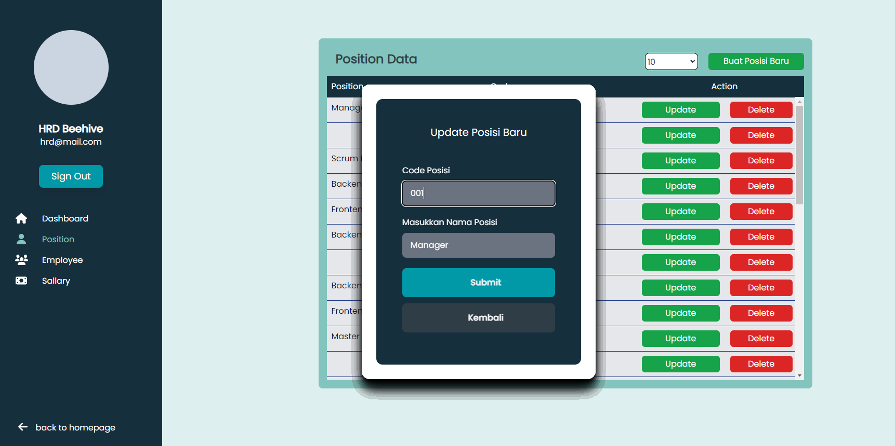

# Beehive_Drones_Intern
Penugasan intern beehive drones berupa Website Responsive.
Aplikasi frontend ini dibuat menggunakan React-Tailwind Framework

## Instalasi
```
npm install
npm start
Server akan berjalan di localhost:3000
```

## Login Interface
### Login Desktop

### Login Mobile


## Dashboard Interface
### Dashboard Desktop

### Dashboard Mobile

### Dashboard Mobile with Dropdown


## Position Interface
### Position Desktop

### Position Mobile

### Position Baru Desktop

### Position Baru Mobile

### Position Delete Desktop

### Position Update Desktop


## Employee Interface
### Employee Desktop

### Employee Mobile

### Employee Baru Desktop

### Employee Baru Mobile

### Employee Delete Desktop


## Sallary Interface
### Sallary Desktop

### Sallary Mobile

### Sallary Baru Desktop

### Sallary Baru Mobile

### Sallary Delete Desktop

